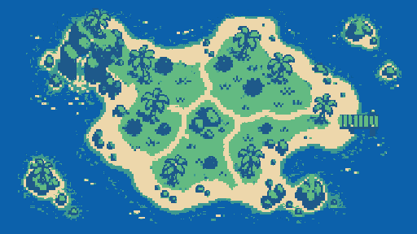
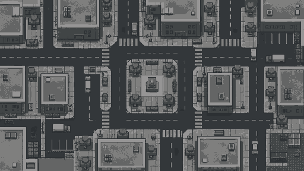
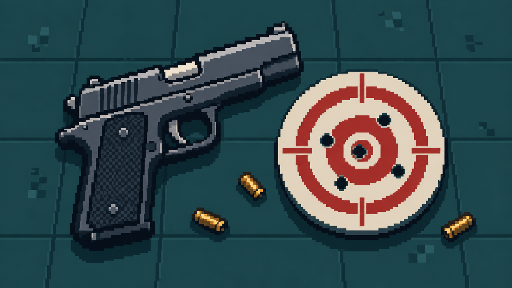
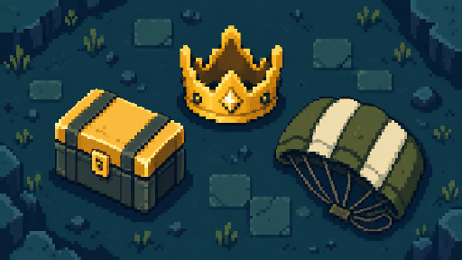

<div align="center">

# 🧊 Cubism 2

**2D top-down шутер на Godot 4 с зомби, лутом, бойцами-суперсилами и онлайн-матчами на 20 игроков**


[](https://youtube.com/@julfed7?si=40empst0Lr6hHNzP)

</div>

---

## 📖 О проекте

В **Cubism 2** игрок оказывается на арене, полной зомби и соперников. Нужно найти оружие в сундуках, вовремя подлечиться, спрятаться в кустах и выжить дольше остальных. Игра подходит как для спокойного прохождения в одиночку, так и для динамичных онлайн-матчей: комнату можно создать самому или быстро найти через матчмейкер.

Проект написан на типизированном GDScript, работает на рендерере `gl_compatibility` и поддерживает ПК (мышь и клавиатура, геймпад) и мобильные устройства (виртуальный джойстик).

<div align="center">

| Остров | Город |
|:---:|:---:|
|  |  |

| Классический | Королевская битва |
|:---:|:---:|
|  |  |

</div>

---

## ✨ Возможности

- 🎯 **Три режима**: классический бой, королевская битва и захват кристаллов
- 🗺 **Три карты**: `Island`, `City` и `CrystalArena`
- 🧟 **Зомби** с поиском пути, обходом друг друга и анимациями ходьбы, атаки и смерти
- 🔫 **Пять видов оружия**: пистолет, SMG, дробовик, винтовка и ближний Кристальный клинок
- 🎒 **Инвентарь на 9 слотов**, отдельные магазины и запас патронов под каждое оружие, аптечки
- 📦 **Сундуки с лутом** и выпадение снаряжения из погибших игроков
- 🦸 **Три бойца** с разными характеристиками и суперспособностями
- 🌿 **Стелс-кусты**: игрок в кустах становится полупрозрачным, а индикатор обнаружения в HUD показывает близость зомби
- 🌐 **Онлайн до 20 игроков** с матчмейкером, лобби и NAT punch-through
- 📈 **Прогресс**: трофеи, монеты, победы и число матчей сохраняются между запусками
- 🔊 **Звук**: музыка лобби и матча, шаги по траве, камню и дереву, отдельные звуки каждого оружия
- 📱 **Мобильное управление** через виртуальный джойстик и сборка под **Android**

---

## 🎮 Режимы игры

| Режим | Длительность | Правила |
|---|:---:|---|
| **Классический** | 150 с | Бой с зомби и соперниками, респавн через 5 секунд |
| **Королевская битва** | 210 с | Зона сужается с 1200 до 260 единиц, вне неё игрок получает урон. Респавна нет, побеждает последний выживший |
| **Захват кристаллов** | 120 с | Нужно собрать 10 кристаллов. Захваченный кристалл появляется снова через 3 секунды. Игроки начинают матч с Кристальным клинком |

---

## 🦸 Бойцы

| Боец | Роль | Здоровье | Скорость | Суперспособность |
|---|---|:---:|:---:|---|
| **Шелли** | Штурмовик | 115 | 500 | **Разнос** — широкая волна урона с отбрасыванием врагов |
| **Кольт** | Стрелок | 95 | 540 | **Шквал** — серия из семи усиленных пуль вперёд |
| **Спайк** | Контроль | 100 | 470 | **Сад** — восстановление здоровья и урон по области вокруг |

Заряд супера растёт от нанесённого урона, а готовность отображается в HUD.

---

## 🔫 Арсенал

| Оружие | Урон | Скорострельность | Магазин |
|---|:---:|:---:|:---:|
| Пистолет | 20 | 0.35 с | 12 |
| SMG | 9 | 0.08 с | 30 |
| Дробовик | 12 × 8 дробин | 0.75 с | 6 |
| Винтовка | 30 | 0.22 с | 20 |
| Кристальный клинок | 26 | 0.45 с | ближний бой |

**Расходники:** аптечка (+50 HP, стак до 5), патроны каждого типа (стаки до 40–120).

---

## 🕹 Управление

| Действие | Клавиши |
|---|---|
| Движение | `W` `A` `S` `D`, стрелки, стик или D-pad геймпада |
| Прицел | Мышь |
| Стрельба / удар в ближнем бою | Левая кнопка мыши |
| Перезарядка | `R` |
| Использовать предмет | `E` |
| Выбор слота | `1`–`9` |
| Смена оружия | Колесо мыши |
| Суперспособность | `Пробел` или кнопка «СУПЕР» в HUD |

На мобильных устройствах движением управляет виртуальный джойстик.

---

## 🌐 Мультиплеер

Матчи строятся по схеме **«авторитарный хост»**: один игрок создаёт комнату, остальные подключаются к нему напрямую.

- **Матчмейкер** (WebSocket) — создание комнат и поиск матча по режиму и карте
- **Noray** (`netfox.noray`) — NAT punch-through с автоматическим переходом на relay
- **ENet** — передача игровых данных
- **Лобби** со списком игроков и запуском матча хостом

**Сетевая модель**

- Хост проверяет стрельбу, дистанции подбора, наличие патронов, скорострельность, захват кристаллов и ближние атаки, а клиенты отправляют только запросы
- Снапшоты состояния игроков и зомби рассылаются примерно 30 раз в секунду
- Каждый клиент получает только объекты в радиусе 800 единиц
- Частота репликации адаптивная: ближние к игрокам объекты синхронизируются чаще
- Движение удалённых игроков и зомби сглаживается интерполяцией и экстраполяцией
- Позиции квантуются, чтобы уменьшить трафик
- Опоздавшим клиентам отправляется полный снимок текущего мира

---

## 🗂 Структура репозитория

```
Cubism-2/
├── addons/
│   ├── netfox.internals/     # Внутренние утилиты netfox
│   └── netfox.noray/         # Клиент Noray и PacketHandshake
├── autoloads/
│   ├── GameState.gd          # Ник, боец, трофеи, монеты, победы
│   ├── NetworkManager.gd     # Матчмейкер, Noray, ENet, RPC, снапшоты
│   ├── SettingsManager.gd    # Ник и громкость (музыка, эффекты, шаги)
│   └── UISoundManager.gd     # Пул звуков интерфейса и шагов
├── scenes/
│   ├── maps/                 # Island, City, CrystalArena
│   ├── objects/              # Player, Zombie, Bullet, Chest, Pickup, Crystal, Bush
│   ├── ui/                   # HUD, DeathPanel
│   └── *.tscn                # Меню, лобби, настройки, выбор бойца и уровня
├── scripts/                  # Игровая логика: game, player, zombie, inventory, hud и др.
│   ├── brawler_database.gd   # Данные бойцов
│   └── item_database.gd      # Данные оружия и предметов
├── sounds/                   # Музыка и звуковые эффекты
├── sprites/                  # Спрайты, тайлсет, превью карт и режимов
├── export_presets.cfg        # Пресеты экспорта (Android, Windows)
└── .github/workflows/        # Сборка APK в GitHub Actions
```

---

## 📥 Установка

### 📱 Android

1. Открыть раздел [**Releases**](../../releases) репозитория и скачать последний `game.apk`
2. Перенести файл на телефон (если он скачан не с самого устройства)
3. Разрешить установку из неизвестных источников: при первом запуске APK Android предложит открыть настройки и включить этот пункт для браузера или файлового менеджера
4. Открыть `game.apk` и подтвердить установку
5. Запустить **Cubism 2**, ввести ник в настройках и выбрать режим

### 🖥 Windows

Готовых сборок для Windows в релизах пока нет, поэтому есть два способа:

**Вариант 1. Запуск из редактора Godot**

1. Установить [Godot 4.7](https://godotengine.org/download) (подойдёт версия 4.3 и новее)
2. Скачать репозиторий: **Code → Download ZIP** и распаковать архив, либо выполнить `git clone https://github.com/<username>/Cubism-2.git`
3. В Godot нажать **Import**, выбрать файл `project.godot` и нажать **Import & Edit**
4. Нажать **F5**, чтобы запустить игру

**Вариант 2. Собственная сборка `.exe`**

1. Открыть проект в Godot и перейти в **Project → Export**
2. Выбрать готовый пресет **Windows Desktop**
3. Если Godot предложит скачать шаблоны экспорта, согласиться (**Manage Export Templates → Download and Install**)
4. Нажать **Export Project** и выбрать папку для сохранения
5. Запустить получившийся `.exe`

### 🌍 Первый запуск и онлайн

1. В разделе **НАСТРОЙКИ** задать ник и громкость
2. В разделе **БОЙЦЫ** выбрать персонажа
3. Для одиночной игры нажать **ИГРАТЬ** и выбрать уровень
4. Для онлайн-матча нажать **СОЗДАТЬ КОМНАТУ** (чтобы стать хостом) или **НАЙТИ ИГРУ** (чтобы подключиться к другим игрокам): сначала выбираются режим и карта, затем кнопка **ИГРАТЬ**

Для онлайн-игры нужно подключение к интернету. Хост принимает соединения напрямую через Noray, поэтому дополнительная настройка роутера, как правило, не требуется.

---

## 🚀 Запуск

### Требования

- [Godot 4.7](https://godotengine.org/download) (минимум 4.3 из-за `TileMapLayer`)
- Для онлайн-игры нужен доступ к матчмейкеру и серверу Noray

### Из редактора

```bash
git clone https://github.com/<username>/Cubism-2.git
```

1. Открыть Godot и выбрать **Import** → `project.godot`
2. Запустить проект клавишей **F5** (главная сцена — `scenes/MainMenu.tscn`)

Для проверки мультиплеера на одном компьютере подойдёт **Debug → Run Multiple Instances**: один экземпляр создаёт комнату, остальные ищут матч.

### Адреса серверов

Параметры подключения находятся в начале `autoloads/NetworkManager.gd`:

```gdscript
const NORAY_HOST: String = "tomfol.io"
const NORAY_PORT: int = 8890
var matchmaker_url: String = "wss://matchmaker-jpk1.onrender.com"
```

---

## 📦 Сборка

Пресеты экспорта настроены для **Windows Desktop** и **Android**.

### Автоматическая сборка APK

Workflow `.github/workflows/release.yml` запускается вручную (**Actions → Build Android APK → Run workflow**). Он собирает подписанный APK через Godot 4.7.2, увеличивает `version/code` по времени сборки и публикует результат в **GitHub Releases**.

Для подписи используются секреты репозитория:

| Секрет | Назначение |
|---|---|
| `ANDROID_KEYSTORE_BASE64` | Keystore в формате base64 |
| `ANDROID_KEY_ALIAS` | Алиас ключа |
| `ANDROID_KEYSTORE_PASSWORD` | Пароль keystore |

---

## 📈 Прогресс игрока

| Итог матча | Трофеи | Монеты |
|---|:---:|:---:|
| Победа | +8 | +25 |
| Поражение | −2 (не ниже 0) | +5 |

Прогресс и настройки сохраняются локально в `user://settings.cfg`.

---

## 🧰 Технологии

- **Движок:** Godot 4.7, рендерер `gl_compatibility`
- **Язык:** GDScript с явной типизацией
- **Сеть:** `MultiplayerSpawner`, `MultiplayerSynchronizer`, ENet, WebSocket, [netfox](https://github.com/foxssake/netfox) (Noray)
- **Навигация:** `NavigationRegion2D` и `NavigationAgent2D` с avoidance
- **Карты:** `TileMapLayer`
- **CI:** GitHub Actions

---

## 🎵 Аудио

Звуковые эффекты — оригинальные синтезированные ретро-звуки в формате WAV: выстрелы каждого оружия, попадания, подбор предметов, открытие сундука, лечение, реакции зомби. Музыка лобби и матча записана в OGG и зациклена. Подробнее в [`sounds/README.md`](sounds/README.md).

---

## 🗺 Планы

- [ ] Командные режимы
- [ ] Новые бойцы и оружие
- [ ] Магазин за монеты
- [ ] Дополнительные карты
- [ ] Рейтинговые онлайн-матчи

---

## 📺 Автор и канал

Новости разработки, геймплей и обновления игры выходят на YouTube-канале автора:

**▶️ [youtube.com/@julfed7](https://youtube.com/@julfed7?si=40empst0Lr6hHNzP)**

---

## 🙏 Благодарности

- [netfox](https://github.com/foxssake/netfox) — аддоны `netfox.internals` и `netfox.noray`, лицензии лежат в `addons/netfox.*/LICENSE`
- [Noray](https://github.com/foxssake/noray) — сервер NAT punch-through и relay
- [Godot Engine](https://godotengine.org)
